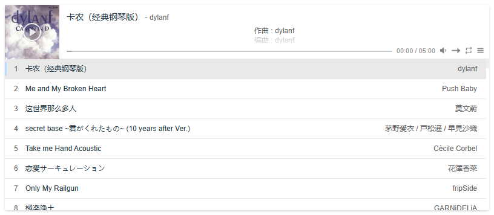

<p align="center">
    
</p>

<h1 align="center">Vue-APlayer</h1>

> Vue 3.x for [APlayer](https://aplayer.js.org/).

项目地址：[**Vue-APlayer**](https://github.com/first19326/APlayer)

演示地址：[**Demo**](https://aplayer.worstone.cn)

## 介绍



使用 Vue 3.x 参考 APlayer 以及 Vue-APlayer 重构的 APlayer。

项目中可能存在一些没有发现的问题，如有发现欢迎反馈。

在您的项目中使用 Vue-APlayer？[让我知道！](https://github.com/first19326/APlayer/issues/1)

## 使用方法

```vue
<template>
	<APlayer :audio="audio" />
</template>
<script setup>
    import { ref, onMounted } from "vue";
	import APlayer from "@worstone/vue-aplayer";
    const audio = ref([]);

    onMounted(() => {
        // 加载歌曲信息并更新 audio
        audio.value = [];
    });
</script>
```

由于组件初始化时，歌曲信息为空，所以会加载默认的样式，在歌曲信息获取后自动进行更新。

如果想要更好的体验，则参考下面的方式使用。

```vue
<template>
	<APlayer :audio="audio" ref="aplayer" />
</template>
<script setup>
    import { ref, onMounted } from "vue";
	import APlayer from "@worstone/vue-aplayer";
    
    const aplayer = ref(null);
    // 设置 2 个或 2 个以上的歌曲信息
    const audio = ref([]);

    onMounted(() => {
        // 加载歌曲信息
        let audios = [];
        aplayer.value.addList(audios);
    });
</script>
```

### VitePress

通过使用 Vue 的服务器端渲染 (SSR) 功能，VitePress 能够在生产构建期间在 Node.js 中预渲染应用程序。这意味着主题组件中的所有自定义代码都 **需要考虑 SSR 兼容性** 。详情参见 [VitePress 文档 - SSR 兼容性](https://vitepress.dev/zh/guide/ssr-compat#clientonly)。

因为 SSR 兼容性的原因，在 VitePress 中可以通过 `defineClientComponent` 方式使用。

```vue
<template>
    <APlayerClientComp :audio="audio" ref="aplayer" />
</template>
<script setup>
import { ref, onMounted } from 'vue'
import { defineClientComponent } from 'vitepress'

const APlayerClientComp = defineClientComponent(() => {
    return import('@worstone/vue-aplayer')
})

const audio = ref([]);

onMounted(() => {
	// 加载歌曲信息并更新 audio
	audio.value = [];
});
</script>
```

[Docs](./docs/README_EN.md)

[中文文档](./docs/README.md)

## 参考

- [APlayer](https://github.com/DIYgod/APlayer) : 🍭 Wow, such a beautiful HTML5 music player.
- [Vue-APlayer](https://github.com/SevenOutman/vue-aplayer) : Vue 2.x implementation of APlayer prototype. 

## 作者

**Vue-APlayer** © [WorstOne](https://github.com/first19326)，在 [MIT](./LICENSE) 许可下发布。

> 主页 - [WorstOne](https://worstone.cn/) · 博客 - [Live For Code](https://notes.worstone.cn/) · 仓库 - [Github](https://github.com/first19326)