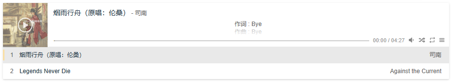

## 安装

使用 npm：

```bash
npm i @worstone/vue-aplayer
```

使用 pnpm：

```bash
pnpm add @worstone/vue-aplayer
```

## 使用

```vue
<template>
	<APlayer :audio="audio" />
</template>
<script setup>
    import { ref } from "vue";
	import APlayer from "@worstone/vue-aplayer";
    const audio = ref([]);

    onMounted(() => {
        // 加载歌曲信息并更新 audio
        audio.value = [];
    });
</script>
```

由于组件初始化时歌曲信息为空，所以会加载默认的样式。在存储歌曲信息变量更新后，播放器会自动进行更新。

如果想要更好的体验，则参考下面的方式使用。

```vue
<template>
	<APlayer :audio="audio" ref="aplayer" />
</template>
<script setup>
    import { ref } from "vue";
	import APlayer from "@worstone/vue-aplayer";
    
    const aplayer = ref(null);
    // 设置 2 个或 2 个以上的歌曲信息
    const audio = ref([]);

    onMounted(() => {
        // 加载歌曲信息
        let audios = [];
        // 添加到播放器列表
        aplayer.value.addList(audios);
    });
</script>
```

## 参数

| 名称          | 类型      | 默认值            | 说明                                                         |
| ------------- | --------- | ----------------- | ------------------------------------------------------------ |
| audio         | 对象/数组 | -                 | 音频信息，应该是一个对象或对象数组                           |
| audio.name    | 字符串    | -                 | 音频名称                                                     |
| audio.artist  | 字符串    | -                 | 音频艺术家                                                   |
| audio.url     | 字符串    | -                 | 音频链接                                                     |
| audio.cover   | 字符串    | -                 | 音频封面                                                     |
| audio.lrc     | 字符串    | -                 | 音频歌词                                                     |
| audio.theme   | 字符串    | -                 | 切换到此音频时的主题色，比 theme 优先级高                    |
| mode          | 字符串    | 'normal'          | 播放器模式，可选值：'normal'，'fixed'，'mini'                |
| autoplay      | 布尔      | false             | 音频自动播放                                                 |
| mutex         | 布尔      | true              | 互斥，阻止多个播放器同时播放，当前播放器播放时暂停其他播放器，仅处于相同页面时生效。 |
| preload       | 字符串    | 'auto'            | 预加载，可选值：'none'，'metadata'，'auto'                   |
| theme         | 布尔      | '#B7DAFF'         | 主题色                                                       |
| autoSwitch    | 布尔      | true              | 根据音频封面自适应主题色，默认开启，需额外加载 [color-thief.js](https://github.com/lokesh/color-thief/blob/master/src/color-thief.js) |
| loop          | 字符串    | 'all'             | 音频循环播放，可选值：'all'，'one'，'none'                   |
| order         | 字符串    | 'list'            | 音频循环顺序，可选值：'list'，'random'                       |
| muted         | 布尔      | false             | 播放器是否静音                                               |
| volume        | 数值      | 0.7               | 默认音量，请注意播放器会记忆用户设置，用户手动设置音量后默认音量即失效 |
| lrcType       | 数值      | 1                 | 歌词类型，可选值：1，2                                       |
| lrcShow       | 布尔      | true              | 歌词默认显示                                                 |
| listFolded    | 布尔      | false             | 列表默认折叠                                                 |
| listMaxHeight | 数值      | 250               | 列表最大高度                                                 |
| storageName   | 字符串    | 'aplayer-setting' | 存储播放器设置的 localStorage key                            |

例如：

```vue
<template>
	<APlayer :audio="audio" mode="normal" autoplay=false mutex=true preload="auto" theme="#FADFA3" autoSwitch=true loop="all" order="random" muted=false volume=0.7 :lrcType=1 lrcShow=true listFolded=false listMaxHeight=250 />
</template>
<script setup>
	import { ref } from "vue";
    
    const audio = ref([
        {
            "title": "烟雨行舟（原唱：伦桑）",
            "author": "司南",
            "url": "https://api.i-meto.com/meting/api?server=netease&type=url&id=1301884692&auth=898d1269a732530c578b63624fe8be0bdfc14205",
            "pic": "https://api.i-meto.com/meting/api?server=netease&type=pic&id=109951167056907210&auth=a4976ca0e04dc7a5592a706e1bd70c93acd1591f",
            "lrc": "https://api.i-meto.com/meting/api?server=netease&type=lrc&id=1301884692&auth=425c4730fe0caf12cf4c0eabacc3398097c8ba49"
        },
        {
            "title": "Legends Never Die",
            "author": "Against the Current",
            "url": "https://api.i-meto.com/meting/api?server=netease&type=url&id=506196018&auth=c5c21102c12896557ecf3fd43a415c050fe757a6",
            "pic": "https://api.i-meto.com/meting/api?server=netease&type=pic&id=109951163918904060&auth=ab3ada1788834c2c30fc14be2320219dbeaebc12",
            "lrc": "https://api.i-meto.com/meting/api?server=netease&type=lrc&id=506196018&auth=9038409d31ec7f40ea7888b77f0839051a2859a5"
        }
    ])
</script>
```



## API

- `init()`：初始化播放器
- `play()`：播放音频
- `pause()`：暂停音频
- `toggle()`：播放/暂停音频
- `seek(time: number)`：跳转到特定事件，时间的单位为秒
- `mute`：切换播放器静音状态
- `setVolume(volume: number, storage: boolean)`：设置音频音量
- `setTheme(color: string, index: number)`：设置播放器主题色，index 默认为当前音频的 index
- `setMode(mode: string)`：设置播放器模式，mode 取值为 'normal'，'fixed' 或 'mini'
- `setLoop(loop: string)`：设置播放器音频循环播放，loop 取值为 'all'，'one' 或 'none'
- `setOrder(order: string)`：设置播放器音频循环顺序，order 取值为 'list' 或 'random'
- `setNotice(text: string, time: number, opacity: number)`：设置通知，时间的单位为毫秒，默认时间 2000 毫秒，默认透明度 0.8，设置时间为 0 可以取消通知自动隐藏
- `skipBack()`：切换到上一首音频
- `skipForward()`：切换到下一首音频
- `destroy()`：销毁播放器
- `showLrc()`：显示歌词
- `hideLrc()`：隐藏歌词
- `toggleLrc()`：显示/隐藏歌词
- `showList()`：显示播放列表
- `hideList()`：隐藏播放列表
- `toggleList()`：显示/隐藏播放列表
- `addList(audios: object | array, clear: boolean)`：添加一个或多个新音频到播放列表
- `removeList(index: number)`：移除播放列表中的一个音频
- `switchList(index: number)`：切换到播放列表里的其他音频
- `clearList()`：清空播放列表
- `audioRef`：原生 audio
  - `audioRef.currentTime`：返回音频当前播放时间
  - `audioRef.duration`：返回音频总时间
  - `audioRef.paused`：返回音频是否暂停
  - 支持大多数 [原生 audio 接口](http://www.w3schools.cn/tags/ref_av_dom.asp)

## 绑定事件

### 音频事件

- abort
- canplay
- canplaythrough
- durationchange
- emptied
- ended
- error
- loadeddata
- loadedmetadata
- loadstart
- mozaudioavailable
- pause
- play
- playing
- progress
- ratechange
- seeked
- seeking
- stalled
- suspend
- timeupdate
- volumechange
- waiting

### 播放器事件

- listshow
- listhide
- listadd
- listremove
- listswitch
- listclear
- noticeshow
- noticehide
- init
- destroy
- lrcshow
- lrchide

## 歌词

### LRC 文件方式

第一种方式，把歌词放到 LRC 文件里，音频播放时会加载对应的 LRC 文件。

```vue
<template>
	<APlayer :audio="audio" :lrcType=1></APlayer>
</template>
<script setup>
    import { ref } from "vue";
    import APlayer from "@worstone/vue-aplayer"
    const audio = ref([
        {
            "title": "烟雨行舟（原唱：伦桑）",
            "author": "司南",
            "url": "https://api.i-meto.com/meting/api?server=netease&type=url&id=1301884692&auth=898d1269a732530c578b63624fe8be0bdfc14205",
            "pic": "https://api.i-meto.com/meting/api?server=netease&type=pic&id=109951167056907210&auth=a4976ca0e04dc7a5592a706e1bd70c93acd1591f", 
            "lrc": "https://api.i-meto.com/meting/api?server=netease&type=lrc&id=1301884692&auth=425c4730fe0caf12cf4c0eabacc3398097c8ba49"
        }
    ]);
</script>
```

### JS 字符串方式

第二种方式，把歌词放到 JS 字符串里面。

```vue
<template>
	<APlayer :audio="audio" :lrcType=2></APlayer>
</template>
<script setup>
    import { ref } from "vue";
    import APlayer from "@worstone/vue-aplayer"
    const audio = ref([
        {
            "title": "烟雨行舟（原唱：伦桑）",
            "author": "司南",
            "url": "https://api.i-meto.com/meting/api?server=netease&type=url&id=1301884692&auth=898d1269a732530c578b63624fe8be0bdfc14205",
            "pic": "https://api.i-meto.com/meting/api?server=netease&type=pic&id=109951167056907210&auth=a4976ca0e04dc7a5592a706e1bd70c93acd1591f", 
            "lrc": "[00:00.00] 作词 : Bye[00:01.00] 作曲 : Bye[00:21.95]编曲：Bye[00:23.58]混音：MR鱼[00:25.24]母带：MR曾经[00:27.09]封面：小草清清[00:38.07]烟雨入江南[00:40.33]山水如墨染[00:43.02]宛若丹青未干[00:44.93]提笔然 点欲穿[00:48.59]行舟临秀川[00:50.89]画鹢推清澜[00:54.06]缱绻怡然[00:58.96]天色沉靛蓝[01:01.64]波光似锦缎[01:04.31]缀着零星白帆[01:06.79]诗情满 千卷难[01:09.79]渔舟齐桅杆[01:12.36]鸳鸯凭舷栏[01:15.37]琴瑟相伴[01:21.05]一叶轻船[01:23.41]一双桨悠懒[01:26.28]一绵江风微拂素罗衫[01:31.95]渔火点点聚散[01:34.38]欸乃声声浅淡[01:37.14]天近晚[01:38.74]炊烟袅飘沿斑[01:42.41]一叶轻船[01:44.73]一双人倚揽[01:47.70]一曲烟雨行舟太缓慢[01:53.16]执手相看[01:55.59]把酒当歌言欢[01:58.73]红尘路漫漫[02:02.05]愿今生与你共览[02:51.49]暮霭渐褪暗[02:53.70]胭脂余味淡[02:56.30]我支着竹绢伞[02:58.75]你闲摆花团扇[03:01.82]浪儿晃曳慢[03:04.30]夜垂云流缓[03:07.54]且吟且谈[03:13.08]一叶轻船[03:15.52]一双桨悠懒[03:18.40]一绵江风微拂素罗衫[03:23.88]渔火点点聚散[03:26.38]欸乃声声浅淡[03:29.10]天近晚[03:30.79]炊烟袅飘沿斑[03:34.57]一叶轻船[03:36.78]一双人倚揽[03:39.69]一雨烟雨行舟太缓慢[03:45.01]执手相看[03:47.48]把酒当歌言欢[03:50.72]红尘路漫漫[03:54.18]欲今生与你共览[03:57.64]一叶轻船[03:58.32]一双月对半[04:01.13]一帘清梦幽幽醉阑珊[04:06.21]移舟靠岸[04:09.10]案前惟剩空盏[04:12.14]莫怨良辰短[04:15.47]曲终了韵意未完[04:20.47]*第一次制作，感谢支持。"
        }
    ]);
</script>
```

### 歌词格式

支持下面格式的歌词：

`[mm:ss]APlayer`
`[mm:ss.xx]is`
`[mm:ss.xxx]amazing`
`[mm:ss.xx][mm:ss.xx]APlayer`
`[mm:ss.xx]<mm:ss.xx>is`
`[mm:ss.xx]amazing[mm:ss.xx]APlayer`


## MSE 支持

### HLS

需要额外加载 [hls.js](https://github.com/video-dev/hls.js)，

```html
<script src="https://cdn.bootcdn.net/ajax/libs/hls.js/1.4.12/hls.min.js"></script>
```

或在项目中直接依赖。

```vue
<template></template>
<script setup>
    import Hls from "hls.js";
</script>
```

## 自适应主题颜色

需要额外加载 [color-thief.js](https://github.com/lokesh/color-thief/blob/master/src/color-thief.js)，

```html
<script src="https://cdn.bootcdn.net/ajax/libs/color-thief/2.4.0/color-thief.min.js"></script>
```

或在项目中直接依赖。

```vue
<template></template>
<script setup>
    import ColorThief from "color-thief";
</script>
```

## 常见问题

### 为什么播放器其他参数不会随着变量进行更新？

初始化参数仅在初始化时生效，其他时间只能通过 API 对播放器进行设置。

### 为什么播放器不能在手机上自动播放？

大多数移动端浏览器禁止了音频自动播放。此外，桌面端的浏览器可能也需要一些设置来实现音频自动播放功能。

## 本地开发

### 克隆代码

```
git clone git@github.com:first19326/APlayer.git
```

### 安装依赖

```bash
cd APlayer
pnpm install
```

### 开发模式

```bash
pnpm dev
```

### 编译打包

```bash
pnpm build
```

完成之后，可以在项目的 `dist` 目录看到编译打包好的文件。